**This is still a work in progress and is incomplete**
***

# Intro/Disclaimers

This submission is largely meant as a proof-of-concept/showcase for the
[`asapdiscovery`](https://github.com/asapdiscovery/asapdiscovery/) and
[`mtenn`](https://github.com/choderalab/mtenn/) frameworks developed by myself and
others in the Chodera Lab and ASAP Discovery Consortium. **Importantly, all code and
data used in this project are publicly accessible. Nothing propietary or confidential
was used, and all results should be replicable by anyone coming across this repo.**

All figures used in this report live in the `figures/` directory and were generated by
various Jupyter notebooks in the `notebooks/` directory. The notebooks are bit
disorganized, but should recreate all the relevant figures if you run them.

# Setup

Installation and setup for `asapdiscovery` and `mtenn` can be found in their respective
documentation. I used development branch versions of both packages (commit
[`d5f686a`](https://github.com/asapdiscovery/asapdiscovery/commit/d5f686a) in the
`add-weight-decay-loss` branch for `asapdiscovery` and commit
[`09564fb`](https://github.com/choderalab/mtenn/commit/09564fb) in the
`add-label-strategy` branch for `mtenn`), so these will unfortunately need to be
installed manually rather than using the `conda-forge` packages. Those may work, but I
haven't done any testing with them for this project.

# Data Acquisition

I opted to work from the raw data package, mainly because I wanted to utilize the date
property in order to train using a temporal split. The data can be downloaded from
[this page](https://polarishub.io/datasets/asap-discovery/antiviral-potency-2025-sample)
or using the following command.

```bash
wget https://fs.polarishub.io/2025-01-asap-discovery/raw_data_package.zip
```

## Extract data and set up directories

We'll unzip the data into its own directory and make a new directory for our parse
datasets:

```bash
mkdir raw_data
mv raw_data_package.zip raw_data/
cd raw_data/
unzip raw_data/raw_data_package.zip
cd ..
mkdir parsed_datasets
```

## Parse the competition training data

We next need to parse these raw CSV files into the format that the `asapdiscovery-ml`
CLI expects. For more information on these formats, please see the
[relevant docs page](https://asapdiscovery.readthedocs.io/en/latest/guides/using_ml_cli.html).

Before running the standard CLI, there is one ad hoc processing script that I had to
write because the data to use for the MERS data are the Minh columns, which are in a
slightly different naming format than expected. After that, the process is mostly
identical for both the SARS and MERS data:

```bash
# Rename the necessary columns
python scripts/parse_minh_values.py

# Parse the CSV files and convert them into the format expected by the ML CLI
asap-cli data download-cdd \
--cache raw_data/SARS-CoV-2-Mpro_potencies_CONFIDENTIAL.csv \
--output parsed_datasets/sars_parsed.csv \
--smiles-fieldname "CXSMILES (CDD Compatible)" \
--id-fieldname "Molecule Name" \
--retain-all \
--assay-name "SARS-CoV-2-MPro_fluorescence-dose-response_weizmann" \
--cheng-prusoff 0,0
asap-cli data cdd-to-schema \
--in-file parsed_datasets/sars_parsed.csv \
--out-json parsed_datasets/sars_exp_file.json

asap-cli data download-cdd \
--cache raw_data/MERS-CoV-Mpro_potencies_CONFIDENTIAL_minh_assay_fixed.csv \
--output parsed_datasets/mers_parsed.csv \
--smiles-fieldname "CXSMILES (CDD Compatible)" \
--id-fieldname "Molecule Name" \
--retain-all \
--assay-name "MERS-CoV-MPro_fluorescence-dose-response_weizmann_minh" \
--cheng-prusoff 0,0
asap-cli data cdd-to-schema \
--in-file parsed_datasets/mers_parsed.csv \
--out-json parsed_datasets/mers_exp_file.json

# Build the ML datasets and cache them
asap-ml build-dataset gat \
--exp-file parsed_datasets/sars_exp_file.json \
--ds-config-cache parsed_datasets/sars_gat_config.json \
--ds-cache parsed_datasets/sars_gat_ds.pkl
asap-ml build-dataset gat \
--exp-file parsed_datasets/mers_exp_file.json \
--ds-config-cache parsed_datasets/mers_gat_config.json \
--ds-cache parsed_datasets/mers_gat_ds.pkl
```

## Download and parse the pretraining data

I also experimented with pretraining models on the publicly available data from the
COVID Moonshot project, which can be downloaded and parsed fully using the
`asapdiscovery` package. Based on the intuition that the graph model I'm using has no
notion of stereochemistry, I only pretrained on the data for which stereochemistry is
either unique or unspecified (achiral molecules and racemates). Additionally, I keep any
semiquantitative measurements, which are treated specially in the loss function (see
docs for more information).

```bash
mkdir raw_data/moonshot

asap-cli data download-cdd \
--cache raw_data/moonshot/cdd_noncovalent_dates_raw.csv \
--output parsed_datasets/moonshot_parsed.csv \
--retain-achiral \
--retain-racemic \
--retain-semiquant

asap-cli data cdd-to-schema \
--in-file parsed_datasets/moonshot_parsed.csv \
--out-json parsed_datasets/moonshot_exp_file.json

asap-ml build-dataset gat \
--exp-file parsed_datasets/moonshot_exp_file.json \
--ds-config-cache parsed_datasets/moonshot_gat_config.json \
--ds-cache parsed_datasets/moonshot_gat_ds.pkl
```

## Some data analysis

Before starting, we'll just [take a quick look at the data](notebooks/ds_dists.ipynb).

Looking at the distributions of the pIC50 values, we can see that the distributions are
fairly similar between the train and validation sets in the competition datasets,
especially as compared to the Moonshot dataset. This makes some sense, as the Moonshot
dataset contains a lot more early-pipeline molecules and the affinity distribution is
therefore likely to shift more drastically over time.

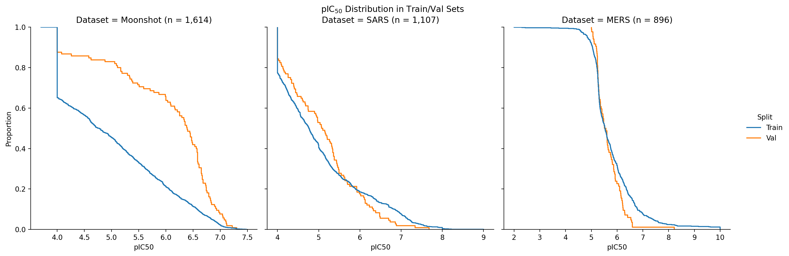

We can also look at how similar the molecules in the validation set and competition test
set are to the molecules in the different train sets. This analysis uses the MACCS166
fingerprint and the Tanimoto similarity. We see that for the competition datasets, the
validation and test sets are both fairly similar to the train set. Their similarity
distributions are also similar, hinting that the val sets might actually be a good proxy
for the test set. The test set molecules are much less similar to the molecules in the
Moonshot train set.

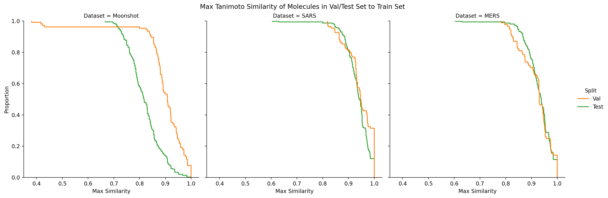

# Set up models and run training

More details on everything are available in the [docs]
(https://asapdiscovery.readthedocs.io/en/latest/guides/using_ml_cli.html).
In this section, we'll set up and run training for the pretraining model (trained on the
Moonshot data) and the two models trained from scratch on the competition data. The
training for the two pretrained models will of course depend on the results from the
pretraining run.

```bash
mkdir trained_models

# Build the Trainer objects and run training
mkdir trained_models/sars
asap-ml build-and-train gat \
--output-dir trained_models/sars \
--trainer-config-cache trained_models/sars/trainer.json \
\
--ds-split-type temporal \
--ds-config-cache parsed_datasets/sars_gat_config.json \
--ds-cache parsed_datasets/sars_gat_ds.pkl \
--train-frac 0.9 \
--val-frac 0.1 \
--test-frac 0 \
\
--pred-readout pic50 \
\
--loss loss_type:mse_step \
--target-prop pIC50 \
\
--device cuda \
--n-epochs 5000

mkdir trained_models/mers
asap-ml build-and-train gat \
--output-dir trained_models/mers \
--trainer-config-cache trained_models/mers/trainer.json \
\
--ds-split-type temporal \
--ds-config-cache parsed_datasets/mers_gat_config.json \
--ds-cache parsed_datasets/mers_gat_ds.pkl \
--train-frac 0.9 \
--val-frac 0.1 \
--test-frac 0 \
\
--pred-readout pic50 \
\
--loss loss_type:mse_step \
--target-prop pIC50 \
\
--device cuda \
--n-epochs 5000

mkdir trained_models/moonshot
asap-ml build-and-train gat \
--output-dir trained_models/moonshot \
--trainer-config-cache trained_models/moonshot/trainer.json \
\
--ds-split-type temporal \
--ds-config-cache parsed_datasets/moonshot_gat_config.json \
--ds-cache parsed_datasets/moonshot_gat_ds.pkl \
--train-frac 0.9 \
--val-frac 0.1 \
--test-frac 0 \
\
--pred-readout pic50 \
\
--loss loss_type:mse_step \
--target-prop pIC50 \
\
--device cuda \
--n-epochs 5000
```

# How'd we do?

Let's take a look at well the models performed on the val sets of their respective
targets.

## Training from scratch

For each of these models, I ran three training runs: one with fully random
initialization (ie no random seed set), and two with set model seeds used for
initiailizing weights. This will give us an idea of how robust the results are to
initial model weights.

Looking at the training curves, it seems that the results are relatively similar across
the different model initializations. The curves for the MERS models look almost
identical, although there is definitely a noticeable difference for the SARS models
between the model initialized fully randomly and the ones initializes with set seeds.

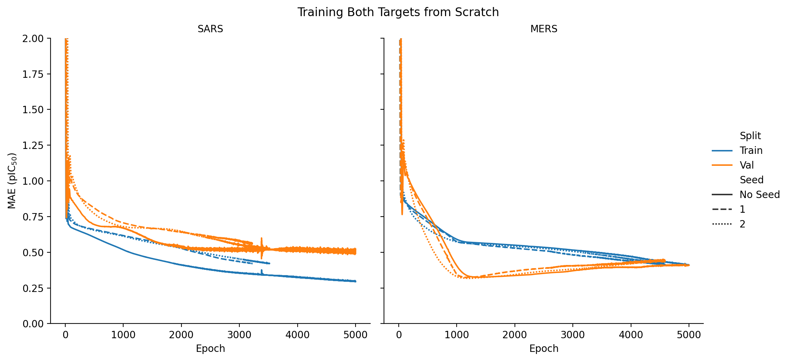

We can also examine how well each model does on recapitulating the target value on a
per-compound basis. The below plots show each model's predictions from the epoch at
which that model achieved its lowest validation set MAE. These distributions show that
there is little difference between the models trained with different initial weights.
There seems to be some positive correlation for the SARS model, although it's not
particularly strong. The MERS model seems to have much less correlative signal, and the
model seems to have just learned to predict ~the mean of the train set (horizontal
gray dashed lines).

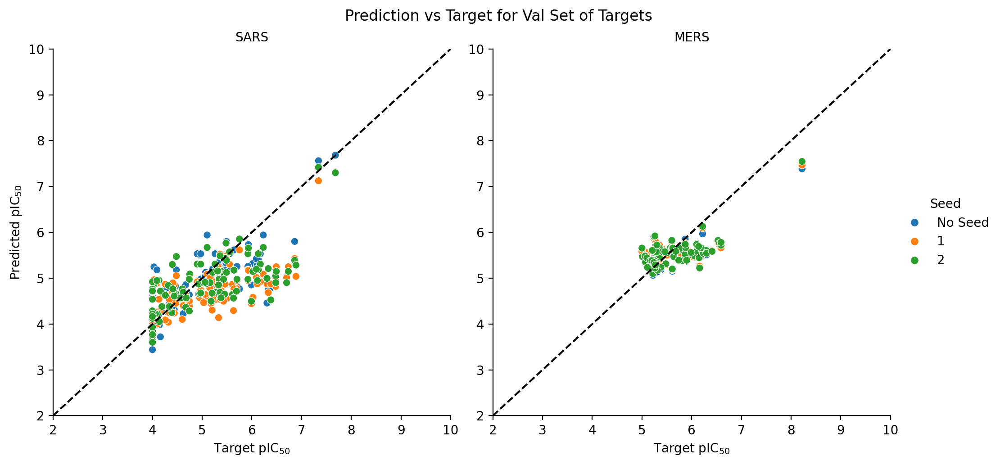

We can check these qualitative results by plotting some summary statistics for the above
plots (along with a bootstrapped 95% confidence interval). As expected, although both
models are able to get below 1 pIC50 unit in both the MAE and RMSE, both calculated
correlation metrics are fairly low for the MERS model.

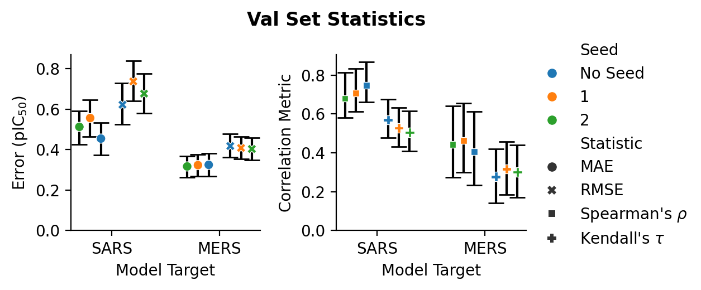

Finally, we can take a look at the distribution of our final test set predictions. As
we were seeing in the previous plots, the MERS predictions are fairly normally
distributed around the train set mean (dashed vertical lines). Likely, the MERS model
has overfit to the train distribution. The SARS model on the other hand seems to be
predicting a fairly wide (but still reasonable) range of values, but obviously it still
remains to be seen if these values are correct.

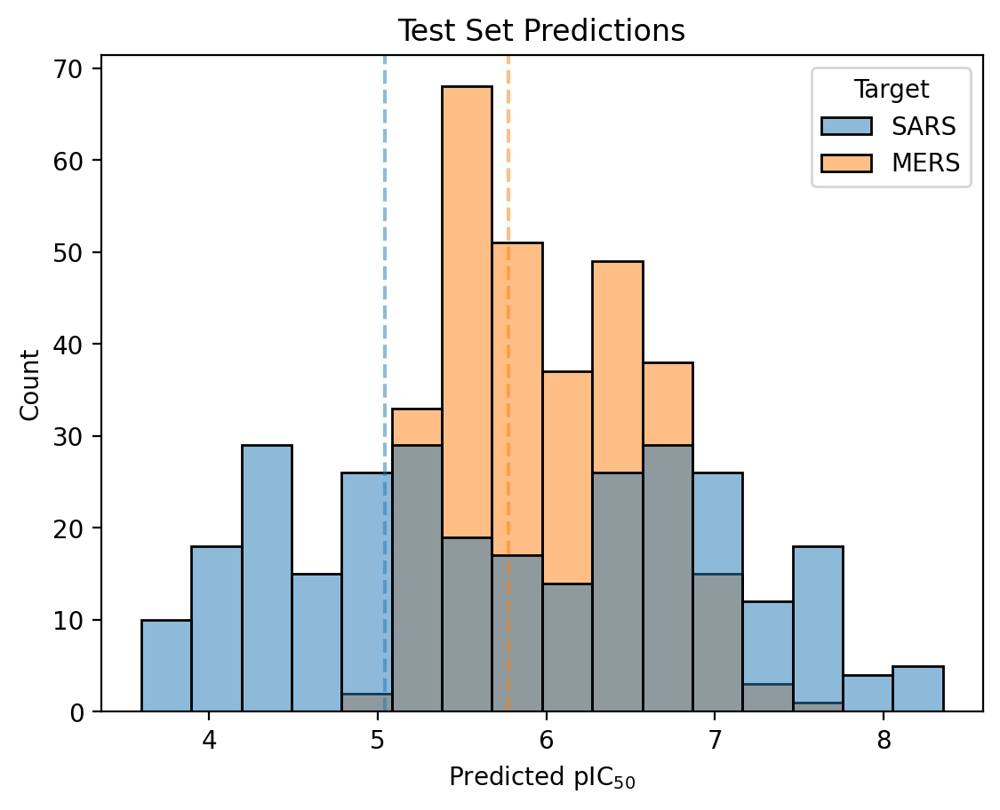

## Pretraining

I also tried pretraining these models on the publicly available data from the COVID
Moonshot project. The process for this was to first train a model on the pretraining
dataset, then pick the epoch with the best MAE and use the weights from that epoch as
the initial weights to train models on both of the competition datasets. We can look at
the training curves and model predictions for the pretraining run, just for some QC, and
we see that the model does seem to have learned reasonably well for this pretraining
dataset.

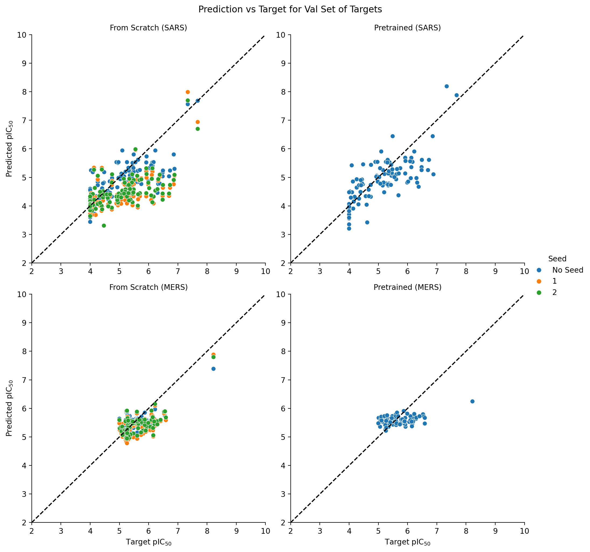
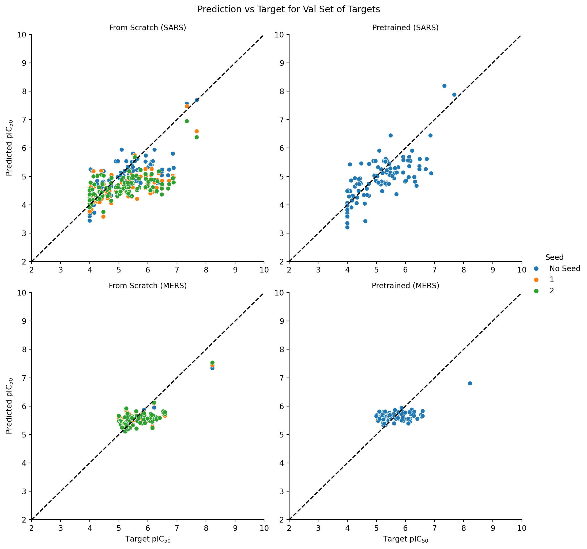

For training the target models, I only used the pretraining run without a specified
initial model seed. It seems that neither of the pretrained models are able to
outperform the models trained from scratch. This may be due to the differences in the
data that we saw in our analysis step at the beginning. One other interesting thing to
note is that the pretrained MERS model initially performs much better on the validation
set than the train set. This possibly indicates that the MERS validation set is more
similar to the Moonshot train set than the MERS train set is. Regardless, the best
performance that the pretrained models are able to achieve seems to be on par with the
performance of the models trained from scratch.

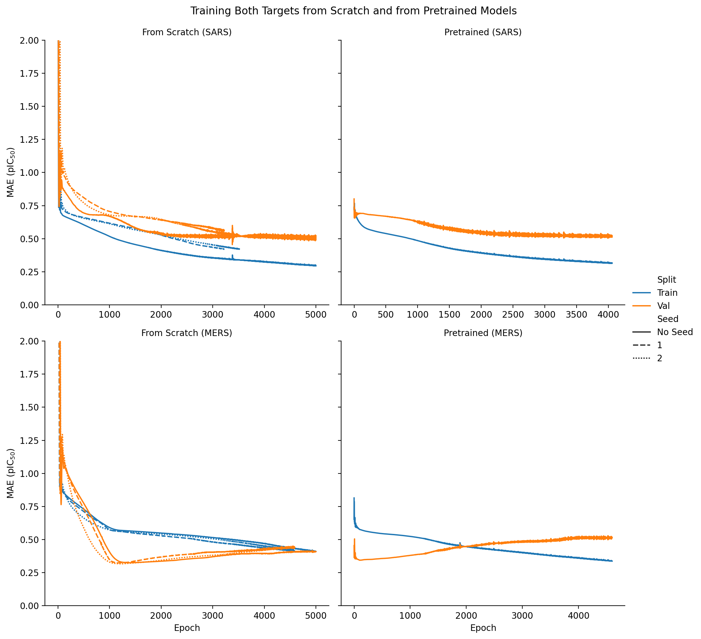
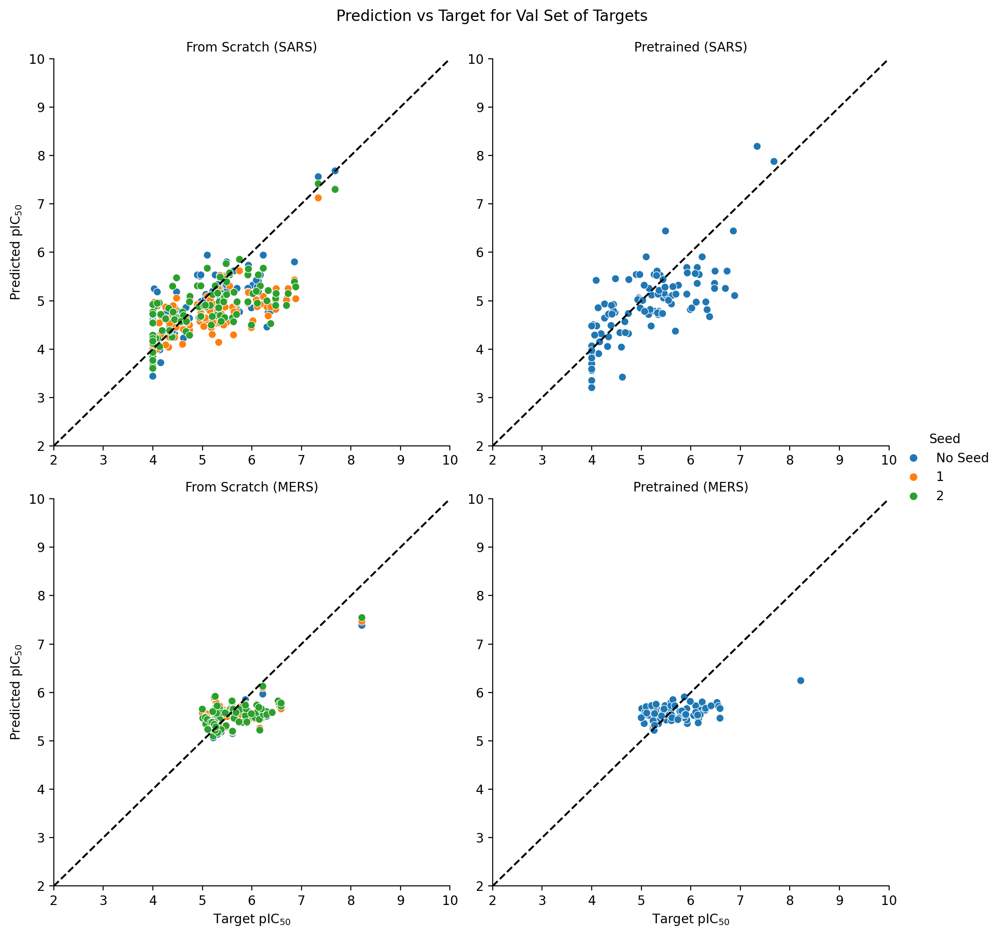
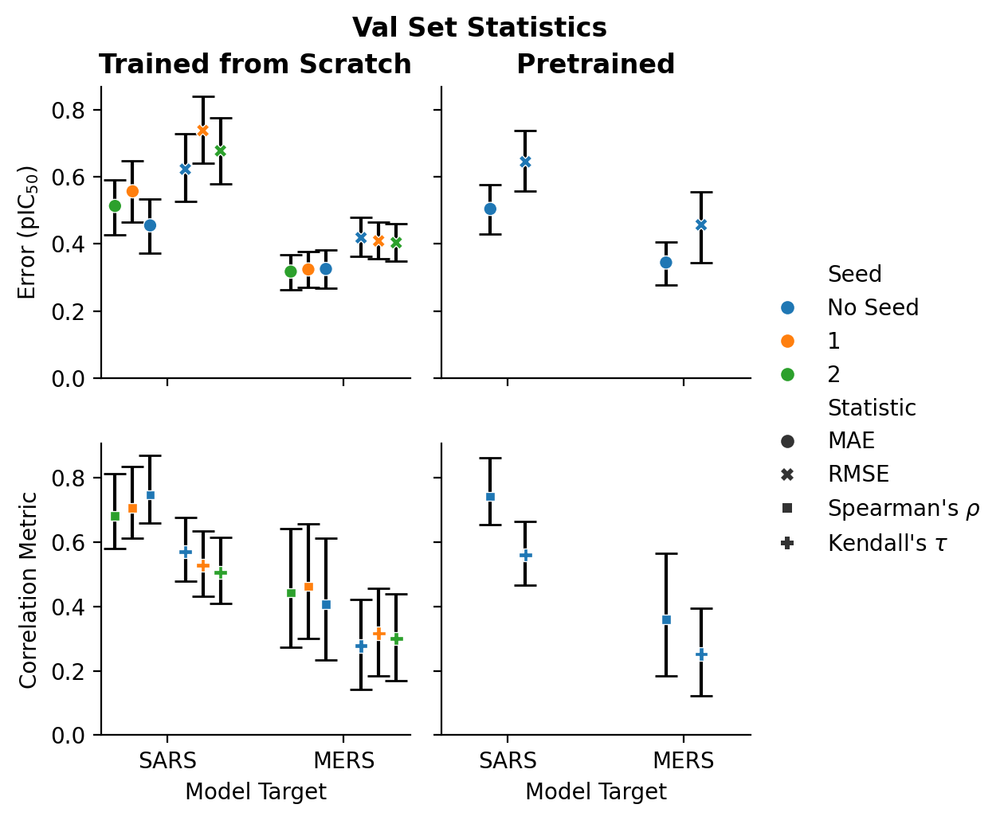
